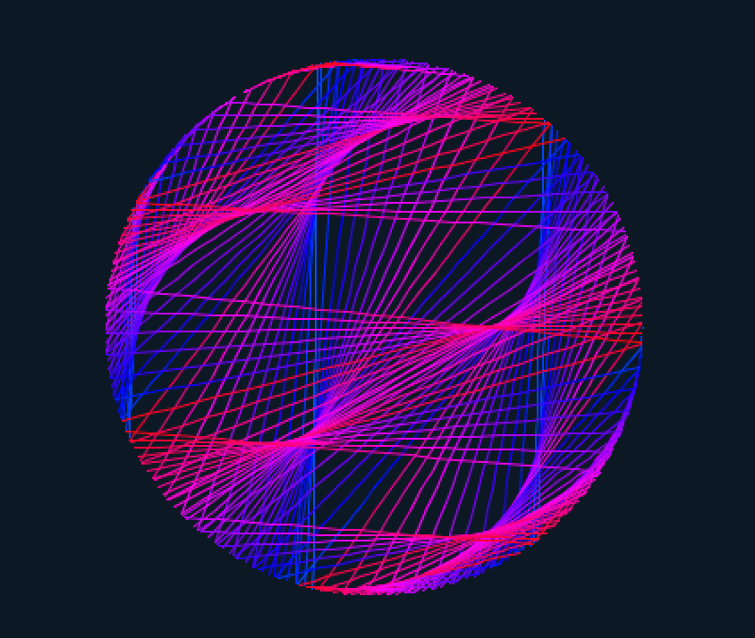
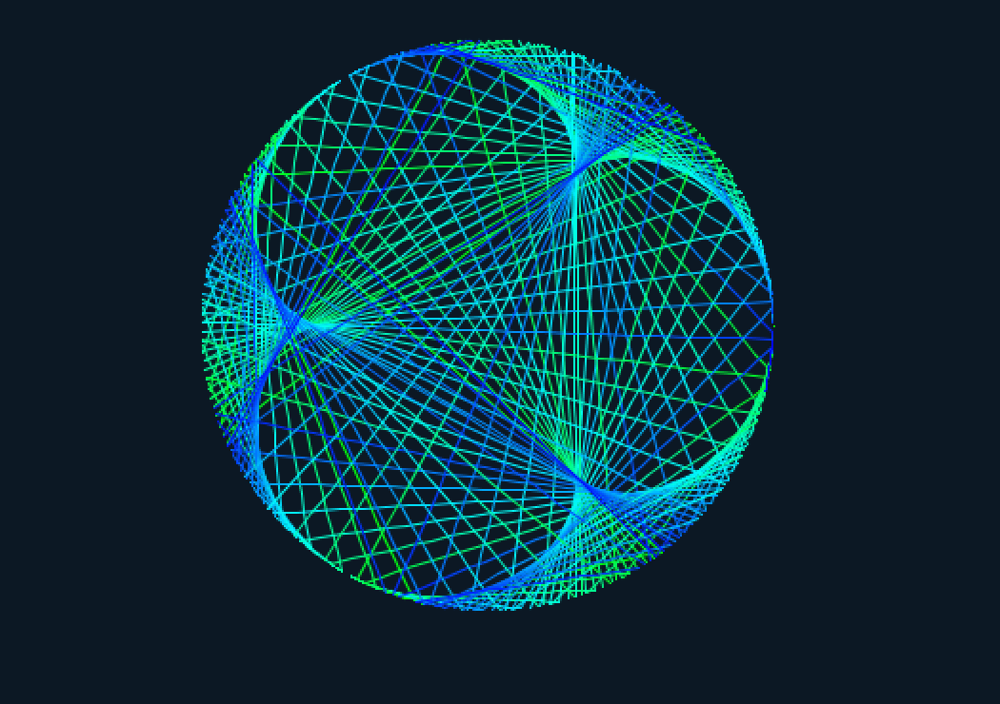
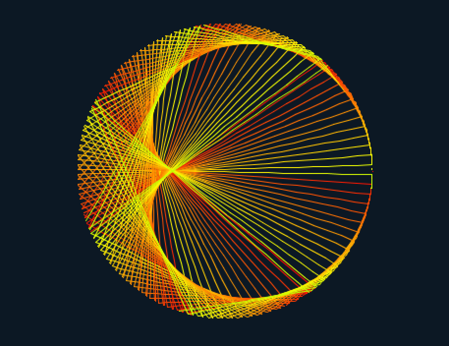
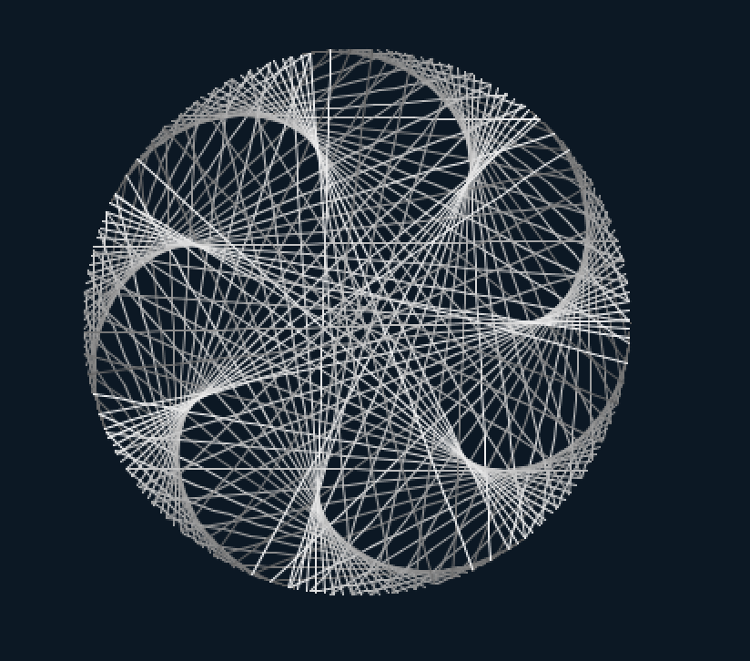

# PlouffeCircles
What if the Times Tables we memorized in 3rd grade became Times *Circles*??

Let's say we want to compute times circles up to and including 200 x 200. To render the circle, we put 200 equally spaced points along a circle and number them in counter-clockwise fashion. This point-numbering system follows modular arithmetic, so the numbers 1, 201, 401, ... will all get mapped to the same point on the circle. More generally, if we have n points on our circle, then all the real numbers R + nk for some integer k will get mapped to the same point on the circle.

We then specify a scale factor called alpha. We draw a chord between two points p1 and p2 on the circle if (p1 * alpha) mod num_points == p2.

In the provided code, loop through several values of alpha and render the corresponding circle with 200 points.

Ok, enough reading, here are a couple of frames from the code:


 

 

This project was inspired by a [Mathologer video](https://www.youtube.com/watch?v=qhbuKbxJsk8&t=333s&ab_channel=Mathologer) that explored times tables and modular arithmetic. The original idea of using Times Circles instead of Times Tables comes from a French mathematician named [Simon Plouffe](https://en.wikipedia.org/wiki/Simon_Plouffe). All the credit for this project goes to these two sources.


## Setup
You'll need the Processing IDE to run this code. Download it [here](https://processing.org/download).

The main script is titled ```TimesCircle.pde```. In it you'll see a number of parameters that you can tweak in order to change the animation. The most interesting parameter is called ```step```. This dictates the values of alpha that the code loops through.

To modify colors, you can change the ```hSrc``` and ```hDst``` variables in ```Chord.pde```. The first and second arguments to the linear interpolation (```lerp```) function provide the H value of an HSB-formatted color. The current settings will make an image with the same color
scheme as ```images/img1``` (ie. red-violet).
